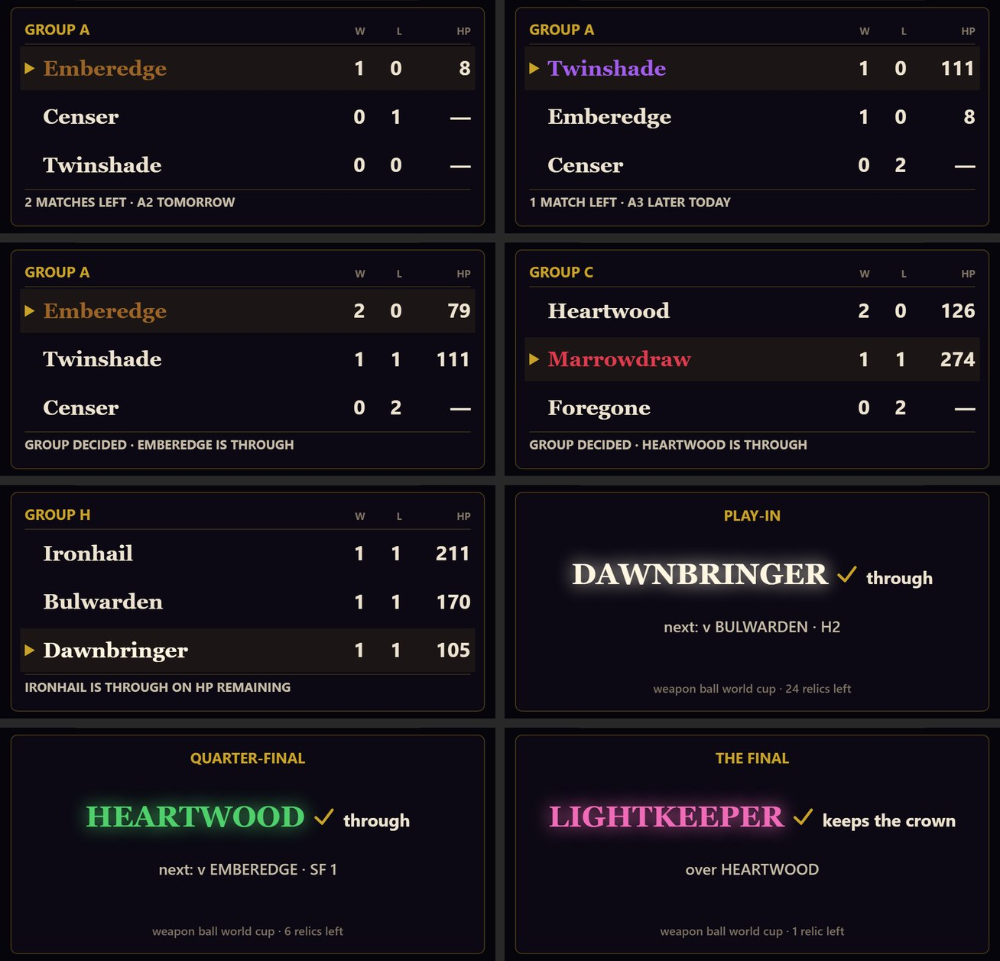
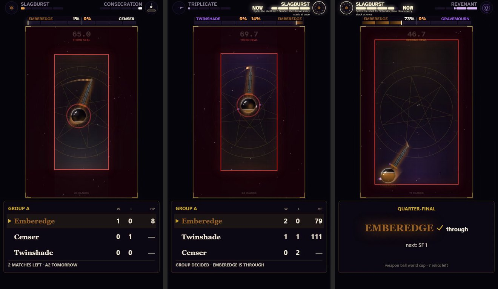

# v118 — THE WEAPON BALL WORLD CUP'S VERDICT CARD (plan v115 §5.3): BUILT, GATED, FILMED — LIVE (GAME, 2026-10-01)

Claude Code on DESKTOP-DERRAFT, 2026-09-30, from the handoff the previous session left in this file (its brief is
`BUILD-BRIEF-v118.md`, its rulings and next steps are kept below). Built on Rick's "build it from the sketch".

**The link is `02-chain/sc-cupcard.html`** (sha256 `3863ef311c02a1f8…`), made by `tools/cupcard_build.py` from the
live `sc-candidate-49.html`. With no card set it is the live game, frame for frame. With a fixture's card set, the
verdict beat draws the plan's §5.3 card in place of the HP recap. **GAME moved to it on 2026-10-01** (Rick: "Go
full balls"): `npm run identity` + `shell_identity.py` **196/196 identical** (`runs/live/`).



## Rick's answers on the first cut (2026-09-30, evening) — applied

| asked | Rick | done |
|---|---|---|
| the hold (2.4 s after the card arms) | "hold it a little longer" | **3.5 s** (`cup.py` `CARD_HOLD`, passed as `--verdict-hold`; the audio tail follows it) — about 3 s with the card fully up instead of 2 |
| "LATER TODAY" for a same-day match | "lets not talk about upcoming matches and promise upload times" | **the card says what happened, never what is next**: no `next: v X · QF 2`, no `2 MATCHES LEFT · A2 TOMORROW`. An open group's card is the table alone; a knockout card's line under the winner is `N relics left` (the sketch's footer number, moved up), the footer the tournament's name. Nothing on the card depends on the posting schedule any more |
| (same answer) | "but i would like the announcer to say the stakes of each match out loud" | **built**: after "Who wins?" the announcer says the round and the band's stakes — *"Group A, match two of three. Lose and Censer is out."* (below) |
| plan §9.7 must be settled before filming | "dont understand this question" | **moot now**: it only mattered because the card printed a day word |

The card's link did not change: `_panelCup` already skips an empty line, so the new wording is all cup.py's.

### The announcer says the stakes

`cup.py film` passes `--announce "<round> |0.3 <stakes>"` to shorts_build, which hands it to `cinema_vo --hook --then`.
The words are the stakes band's own (`band_lines`, the one source), read as sentences: the round from the fixture
(*"Group A, match two of three."*, *"Round of sixteen, match three."*, *"Quarter-final two."*, *"The final."*), then the
band's sub-line in sentence case with every relic by its display name — an upper-case name could be spelled out
letter by letter, and the compound names need cinema_vo's `SPOKEN` splitting, which is keyed on them. Kokoro was
checked on every shape of line: "Group A" is the letter, numbers are words.

**Placement: after the hook** (`THEN_GAP` 0.45 s after "Who wins?"). Spoken first, the stakes would push both names off
their own ignitions, which is the timing Rick chose (arm C, 2026-08-29). Measured on A2 (Censer v Twinshade):

```
0.10 s  "Censer, or"   1.43 s  "Twinshade."   2.43 s  "Who wins?"
3.68 s  "Group A, match two of three."        5.72 s  "Lose and Censer is out."      ends 7.53 s
```

**Filmed through `cup.py film --only A2`** on the scratch draw (second cut: all of the above): 86.2 s, 1080x1920
h264+aac, -15.7 LUFS, -0.7 dBTP, every mark passes; the card agreed with the sim and the filmed match; the card is
up for the last ~3.5 s with the open group's table alone. **Nobody has listened to it by ear yet** — it went to Rick.

## What was built

| file | what |
|---|---|
| `tools/cupcard_build.py` (new) | the builder. Three inserts: `cup: null` in CONFIG; drawScrunchPanel's verdict branch draws `_panelCup` when `CONFIG.cup` is set; `Renderer._panelCup`. Refuses: an anchor not exactly once, a source with CR bytes or that already has the card, any line moved besides the one verdict-branch line, an added line that draws the rng / adds a Math.random / **writes a field of the match, a fighter or AC** (a chain of fields, so `m.a.hp = 1` is caught), a page that does not parse, an existing link. |
| `02-chain/sc-cupcard.html` (new) | the link: +6,663 chars on `sc-candidate-49` (1 line replaced, 127 added). |
| `tools/cup.py` | the feed: `cupjson <fixture>` and `film` passing `--cup-json`. Listed for Cowork below. |
| `tools/test_cup.py` | 40 new checks (`card`, `announce`), 94/94 with the old 54. |
| `tools/shorts_build.py` | `--cup-json PATH`, passed through to cinema_clip; the file is read and checked before the capture starts. `--announce SCRIPT`, spoken after the generated hook (refused with `--vo`). |
| `tools/cinema_vo.py` | `--then SCRIPT` with `--hook`: more of the line, `THEN_GAP` after "Who wins?". |
| `tools/cinema_clip.py` | `--cup-json PATH`: sets the blob on `AC.CONFIG.cup` after the harness, the way `--no-card` and `--stakes` reach the page. Refuses a build without `CONFIG.cup`. **Checks the card's result against the fight twice**: the headless sim before the capture, the filmed match after it (winner id and `ceil(hp)`); a disagreement exits non-zero, because the card would print somebody else's win. |
| `tools/cupcard_probe.py` (new) | `--ab`: the verdict-beat identity gate and its controls. `--sheet`: the held verdict frame with each blob, for reading. |
| `05-reference/v118/cupcard-variants-v118.jpg` | the contact sheet above. |

`app/main.js` needs no change: `swb:cupRun` spawns `cup.py film`, and `film` now passes the card itself.

### How a card reaches a short

```
cup.py film  ->  card_blob(L, f)  ->  <fixture folder>/<stem>-cup.json      (also kept in the ledger: f["card"])
             ->  shorts_build.py --cup-json <that file>  ->  cinema_clip.py --cup-json
             ->  AC.CONFIG.cup = blob, before the fight  ->  the verdict beat draws it
```

The renderer draws the blob and decides nothing: every string, the row order and the marker are cup.py's, built from
the ledger **as the viewer of that fixture has seen it** (every result posted after it is hidden first — the band's
no-spoiler rule, applied to the result side). The only thing the page reads for itself is the school colour of the
name that won, off WEAPONS.

## Readings, where the sketch is silent

The sketch draws one group card and one knockout card. Everything below is a reading of it, not new design; all
copy reuses the sketch's or the band's words. **Each is one line in `cup.py` (`card_blob`) if Rick wants it otherwise**
— the card's words are scrunch-card wording, which is his.

1. **The marker** (`▶`) is on **this fixture's winner** — "the relic this match concerns". In a dead rubber it sits
   on a relic that is not top of the table (C3 in the sheet).
2. **HP** is the plan's tiebreak number, HP remaining summed over the relic's wins; **`—`** for a relic with none.
3. **The group footer**, by state after the fixture:
   - group open: **none** (Rick: no upcoming matches, no upload times — the first cut's
     `2 MATCHES LEFT · A2 TOMORROW` is gone).
   - won on wins (incl. after match 2, when two wins already decide it): `GROUP DECIDED · EMBEREDGE IS THROUGH`
   - three-way tie: `IRONHAIL IS THROUGH ON HP REMAINING` (plan §8's "through on HP remaining"), or
     `... IS THROUGH ON DRAW NUMBER`.
4. **The knockout card**: the round as cup.py names it (`ROUND OF 16`, `QUARTER-FINAL`, `SEMI-FINAL` — no match
   number in the title); `<NAME> ✓ through`; under it `12 relics left` — the relics still in it for the crown once
   this fixture has posted (the sketch's footer number, moved up into the line the first cut's `next:` held); the
   footer is the tournament's name, lower case as the sketch writes it.
5. **The play-in** uses the knockout card: `PLAY-IN`, `<NAME> ✓ through`, `48 relics left`.
6. **"Or the final's result"**: the final is `<NAME> ✓ keeps the crown` (the band's ONLY ONE KEEPS THE CROWN) and
   `over <LOSER>` (the recap's own word); the third-place match is `<NAME> ✓ third place`, `over <LOSER>`.
7. **Layout**: the group card left-aligned as the sketch is; the knockout card centred, as the recap it replaces is.
   The winning name in its school colour (the recap's convention), the knockout name with the recap's glow. The
   marker and the tick are drawn paths — U+25B6 has an emoji presentation, and a fallback font could put a blue
   button in the table. Every line shrinks to fit its column, never grows.
8. **The hold** is 3.5 s after the card arms (Rick: "a little longer" than every short's 2.4 s).

## cup.py's changes, for Cowork

Everything existing behaves as before (the old 54 checks pass unchanged). Added or changed:

- `import contextlib`, `import re`; a new block before `file_for`: `CARD_VERSION` (2), `CARD_HOLD` (3.5),
  `posted_through(L, f)` (a context that hides every result posted after `f` and puts them back), `relics_left`,
  `card_blob(L, f)`; then the announcer's: `NUMBER_WORD`, `ANNOUNCE_GAP`, `spoken_round(f)`, `spoken_line(L, text)`,
  `announce_script(L, f)`; then `card_line(blob)` (cp1252-safe log line) and `cmd_cupjson`.
- `cupjson <fixture>` subcommand; prints the blob as ASCII-escaped JSON (a Windows pipe is cp1252).
- `film`: refuses up front when the ledger has no `name` (the knockout card prints it — better at the start than at
  the round of 16); per fixture writes `<stem>-cup.json` beside the mp4 and passes `--cup-json`,
  `--verdict-hold 3.5` and `--announce "<round> |0.3 <stakes>"`; prints `[cup] card: …` and `[cup] announce: …`
  (the app's `cuplines.parseLine` returns null for both, so they go to the log); keeps `f["card"]` and
  `f["announce"]` in the ledger.
- `seeds --redo` clears `card` and `announce` with the other per-fixture keys.

## Gates

| gate | result | control (must come back wrong) |
|---|---|---|
| builder refusals (mutant inserts) | refused all seven: `m.a.hp = 1`, `m.winner = m.loser`, `m.resultT += 1`, `m.fx[0].x = 0`, `AC.CONFIG.combat.baseHP = 1` (writes a sim field), `this.m.rng()`, `Math.random()` | a read-only `m.a.hp === 1` is written (the guard reads writes, not names). **The first version of the guard missed `m.a.hp = 1`** (one dot only); this control found it and it was fixed before anything was committed — the link's bytes are the same either way (`3863ef311c02a1f8` rebuilt) |
| `test_cup.py` | **94/94 OK** (54 old + 40 card and announce; first cut 88/88) | `posted_through` made a no-op (the card sees later results): **6 FAIL**; the first cut's `next: QF 1` put back on knockout cards: **4 FAIL** |
| `chain_audit.py --relic sc-cupcard --tip sc-cupcard --builder cupcard_build.py` | **3/3 inserts survive** | `--tip sc-candidate-49`: **3 LOST** |
| `cupcard_probe.py --ab` (verdict beat, angelus v lodestone 20260930, 1080x1920, 7 frames 0.3-3.4 s after the kill) | **7/7 identical** card off vs the source | noise floor A vs A **7/7**; card set: same before it arms (2/2), **differs 5/5** after |
| card code in the sim | `_panelCup` called **0** times across 4 `simulate()` fights with the card set; the 4 fights identical to the source build's | the same counter: **1** call in one draw of the verdict |
| `engine_ab.py`, all 49 ids, `--n 6` | **7056/7056 identical** field for field, no page errors, 49/49 distinct winners, fights 21.3-156.0 s (750 s a build) | the card cannot reach `simulate()` at all (the row above), so this proves the inserts moved nothing else |
| `render_ab.py`, card unset (4 pairs x 0.5/6/12/22/31/40 s, 540x960) | **24/24 pixel-identical** | the card set is the probe's control above; no fight in these four is over by 40 s, which is why the verdict beat has its own probe |
| `tip_audit.py --game sc-cupcard` | **exit 0**, its report identical to the source build's | |
| `node --check` | the builder's `syntax_check`: 1 inline script block parses | |
| real shorts with the card, through `cup.py film` (scratch 25-relic draw on sc-cupcard, seed 20260930, `--cup weapon-ball-world-cup-test`, named) | **3/3 filmed, every delivery mark passes**: A1 70.7 s -15.2 LUFS -1.6 dBTP; A3 76.3 s -15.1 / -0.6; QF-1 52.4 s -15.8 / -0.8. The card's result agreed with the headless sim AND the filmed match on all three. Frames: the card inside the panel, legible at 1080x1920, the marker on the fixture's winner, the footers right (sheet below; `runs/films.txt`) | refused **before a frame was captured**: a blob naming the wrong winner ("the card says twinshade won on 71 hp, the headless sim says emberedge"), the card on `sc-candidate-49` ("this build has no World Cup verdict card"), a file that is not a card |



A1's card is the no-spoiler rule working in a real film: the ledger already held A2's and A3's results when A1 was filmed, and the card counts A1 alone (Twinshade 0-0). These three are the FIRST cut (2.4 s hold, the `next:` lines
and day words, no spoken stakes); Rick's answers above replaced all three of those.

## Found along the way

1. **The precedent the plan names does not exist here.** Plan §5.3 and the brief cite `tools/cta_build.py` and
   `CONFIG.cta` (a like-and-follow verdict card). Neither is in this repo or its history; the live verdict beat has
   two modes (the legend and the recap). The house pattern followed instead is `balance_build.py`'s (one link,
   exactly-once anchors, the diff checked line by line).
2. **The app's Draw button does not pass `--cup`.** `swb:cupRun` builds `cup.py draw --game … --seed …`, so a draw
   from the panel uses the default seed-rule id `crown-cup-1`, not `weapon-ball-world-cup`. Draw from the terminal
   (step 3 below), or the id in the published rule is `crown-cup-1`.
3. `cupjson`'s first version printed `·` through a cp1252 pipe, so a redirected blob was not UTF-8. Now ASCII-escaped.

## Open decisions (Rick's)

1. ~~**The band's "WINNER MEETS <NAME>".**~~ **Settled, 2026-09-30: kept.** Rick: *"leave the names in for the
   announcer stakes."* The band and the announcer both say "Winner meets Emberedge" where it applies; "no upcoming
   matches" is the card's rule, not the band's.
2. **The announcer's placement**, after "Who wins?" — Code's pick on the reasoning above; the sample short is
   Rick's to overrule.

---

## The handoff this build was taken from (2026-09-30)

### Rick's rulings, 2026-09-30 (do not re-ask)

| | ruling |
|---|---|
| name | **"Weapon Ball World Cup"**: `cup.py schedule --name "Weapon Ball World Cup"`; the seed-rule id at the draw, e.g. `cup.py draw --cup weapon-ball-world-cup` |
| filming machine | **this PC** (Kokoro installed: `tools/kokoro-v1.0.onnx` 325,532,387 bytes, `tools/voices-v1.0.bin` 28,214,398 bytes, both gitignored; kokoro-onnx 0.6.1, onnxruntime 1.30.0, soundfile 0.14.0 in Python 3.13); the ledger binds the draw to the filming machine |
| stakes-band copy (plan §5.1) | **the drafts, as written** |
| verdict card (plan §5.3) | **"build it from the sketch"** -- this doc's build |
| still Rick's | **the draw seed** (any number, published with the draw); plan §9.2 / 9.5-9.7 (third place, post slots, draw-reveal post, dead rubbers) |

### Where things stood

- **The game is LIVE on `02-chain/sc-candidate-49.html`** (`app/main.js` GAME, commit e045c02): 49 relics, the batch
  tip `sc-balance` + Rick's Daybreak circle + yert's seven staves (`06-docs/v117/make_roster.sh`). **This is the
  tournament's frozen build** (plan §7 step 2); the card link goes on top of it.
- **The Cup's app panel is built** (v115, `crown-cup-app-build-v115.md`). Its gate 4 (Electron identity) is
  effectively passed: `npm run identity` + `shell_identity.py` read 196/196 on the live app (06-docs/v117/runs/live/).
  Its gate 3, one real film driven from the panel, is still owed.
- **Smoke test, 18:06: this PC films a full short with the voice-over.** `shorts_build.py --game
  ../02-chain/sc-candidate-49.html --a angelus --b lodestone --seed 20260930 --no-card --stakes "SMOKE TEST"
  --stakes-sub "NOT A CUP MATCH"`: 3951 frames (65.8 s) in 539 s, Angelus on 520 hp, 24 clanks; Kokoro's bm_lewis
  spoke "Angelus, or Lodestone. Who wins?"; 1080x1920 h264+aac, 65.9 s, 32.2 MB, -15.3 LUFS, -0.8 dBTP, every
  delivery mark passes. (Not kept.)

## What is left, and whose

1. ~~Build the card~~ — this doc.
2. ~~**Move GAME to `sc-cupcard.html`**~~ **DONE 2026-10-01, 196/196.** (the orchestrator's): presentation-only, so the fights are identical. Then
   `cd app && npm run identity` + `cd tools && python shell_identity.py`, and commit the json as the go-live commit
   did. **Only when Rick is not using the PC**: it launches Electron (memory: build-load-limit).
3. **Rick's draw seed**, then `cup.py draw --game ../02-chain/sc-cupcard.html --seed <his> --cup weapon-ball-world-cup`
   (from the terminal — found item 2) and `cup.py schedule --name "Weapon Ball World Cup"`. Publish the empty
   bracket (plan §7 step 5).
4. `cup.py seeds`, then `cup.py film` (or the panel's
   Seed all / Film all): 65 shorts, about 3-4 hours of machine time, resumable. Mind v115's "found" item 1: resume
   can pass over a failed short.
5. **Spot-check** the play-in, one group's three, and a semi (plan §7 step 7). Then Rick queues the posts.
